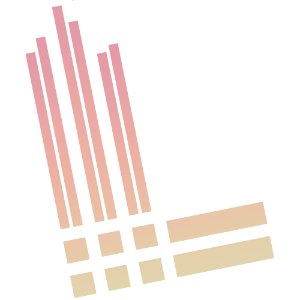
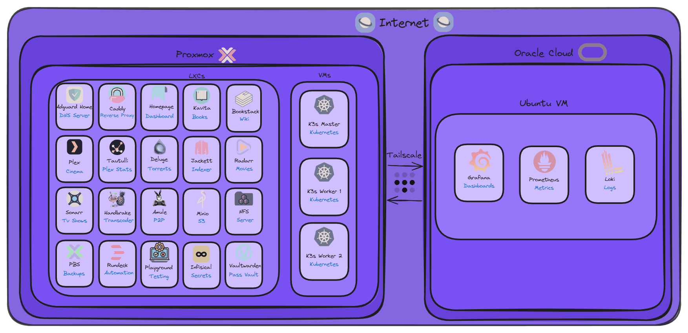
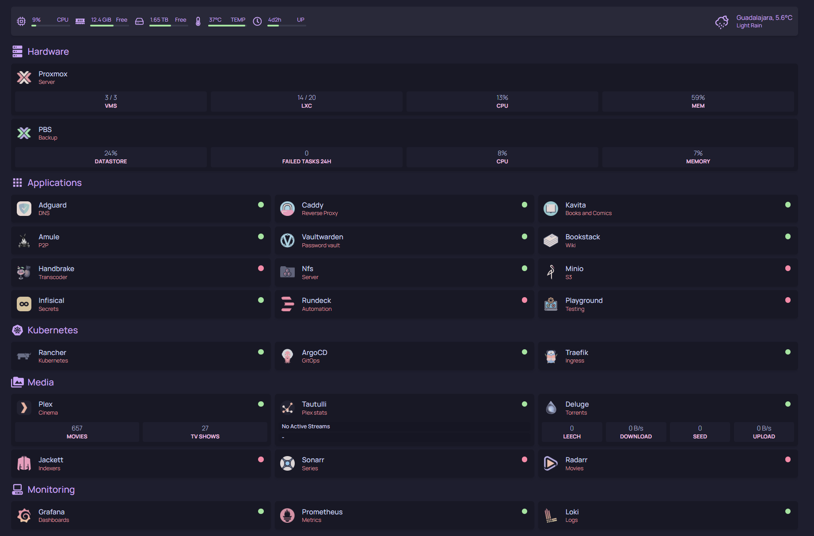
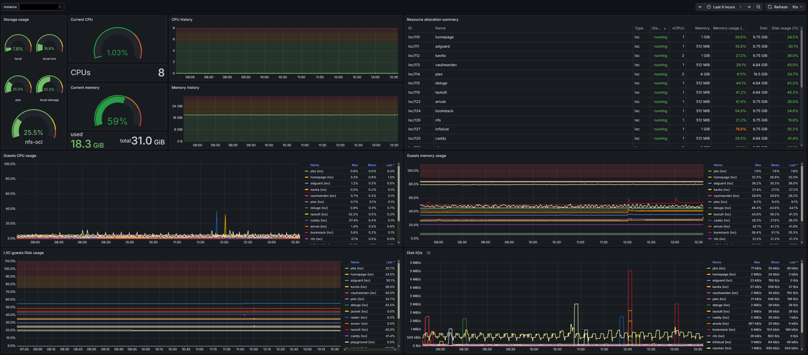

# 🌌 Stargate Homelab

A modular, automated, and exploration‑ready homelab powered by **Proxmox**, **Terraform**, **Ansible**, **Docker**, **Kubernetes**, and more.

Inspired by production‑grade infrastructure patterns — but built for learning, tinkering, and having fun.

---
## ☑️ Prerequisites

Before you start, make sure you have:
- **Spare hardware** (old PC, server, or VM host)
- **Time and curiosity** to experiment and learn!

---
## 📁 Repository Structure
```
stargate-homelab
└── automation
    └── ansible    
    └── terraform
└── docker  
└── kubernetes
    └── argocd
└── observability
    └── prometheus  
└── pictures
└── proxmox
└── tailscale
```

---
## 🎯 Project Goals

The goal of this project is to build a homelab using **Proxmox** as the backbone, enabling you to run daily-use tools, experiment for work, or just have fun tinkering with new tech.

---
## 🧱 Tech Stack

| Icon | Technology | Purpose |
|------|-----------|---------|
|  | **[Proxmox](proxmox/README.md)** | Bare metal hypervisor & virtualization |
|  | **[Terraform](automation/terraform/README.md)** | Infrastructure-as-code provisioning |
|  | **[Ansible](automation/ansible/README.md)** | Configuration management & automation |
|  | **[Docker](docker/README.md)** | Containerization & lightweight services |
|  | **[Kubernetes](./kubernetes/README.md)** | Container orchestration & GitOps |
|  | **[Prometheus](observability/prometheus/README.md)** | Metrics collection & monitoring |
|  | **[Grafana](observability/prometheus/README.md)**| Dashboards & visualization |
|  | **[Loki](observability/prometheus/README.md)** | Log aggregation & analysis |
|  | **[Tailscale](tailscale/README.md)** | Secure mesh VPN networking |

---
## 🖼️ Infrastructure Snapshots




---
## 🤝 Contributing
Contributions are welcome!

1. Fork the repo  
2. Create a feature branch  
3. Commit your changes  
4. Push your branch  
5. Open a Pull Request  

If you want to share your own homelab ideas or improvements, I’d love to see them.

---
## 💬 Support & Feedback
Have questions, suggestions, or want to show your own setup?  
Open an issue — I’m happy to chat.

---
## 🧭 Roadmap
- Expand documentation for each module  
- Add diagrams for network, Kubernetes, and automation flows  
- Improve Terraform + Ansible integration  
- Add more observability components  
- Add CI/CD for homelab automation  

---
> _Made with ❤️ for homelab enthusiasts!_
