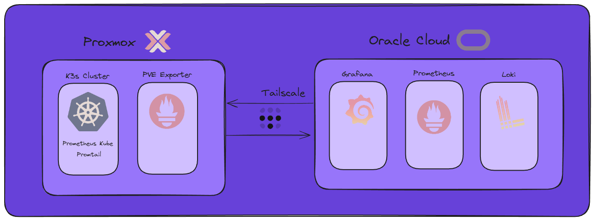

# 📊 Prometheus

Prometheus is a powerful time-series database (**TSDB**) used to store and query metrics.  
Unlike InfluxDB, Prometheus actively **scrapes** metrics from endpoints rather than passively receiving data.

---

## 🚀 Why Prometheus?

- **Pull-based model:** Prometheus scrapes metrics endpoints on a schedule.
- **Flexible:** Works with many exporters and integrations.
- **Rich query language:** Powerful PromQL for analysis and alerting.
- **Ecosystem:** Integrates with Grafana, Alertmanager, and more.

---

## 🛠️ Prometheus Setup

I use the **PVE exporter** to expose metrics from Proxmox VMs and LXCs.  
> **Note:** Node-exporter inside LXCs exposes host metrics, not container metrics—so PVE exporter is preferred.

**Tailscale** is used to allow Prometheus to scrape metrics securely from Proxmox without exposing endpoints to the internet.



---

## 📈 PVE Exporter Setup

Gather metrics about CPU, RAM, disk, and network resources of Proxmox guests (VMs or LXCs) via Prometheus.

### 1. Create Proxmox API User
```sh
pveum user add pve-exporter@pve -password <password>
pveum acl modify / -user pve-exporter@pve -role PVEAuditor
```

### 2. Create Linux User
```sh
useradd -s /bin/false pve-exporter
```

### 3. Create Python Virtual Environment
```sh
apt update
apt install -y python3-venv
python3 -m venv /opt/prometheus-pve-exporter
```

### 4. Install Prometheus PVE Exporter
```sh
source /opt/prometheus-pve-exporter/bin/activate
pip install prometheus-pve-exporter
deactivate
```

### 5. Create systemd Service
Add this to `/etc/systemd/system/prometheus-pve-exporter.service`:
```
[Unit]
Description=Prometheus Proxmox VE Exporter
Documentation=https://github.com/prometheus-pve/prometheus-pve-exporter

[Service]
Restart=always
User=pve-exporter
ExecStart=/opt/prometheus-pve-exporter/bin/pve_exporter --config.file /etc/prometheus/pve.yml

[Install]
WantedBy=multi-user.target
```
Reload systemd, enable and start the service:
```sh
systemctl daemon-reload
systemctl enable prometheus-pve-exporter.service
systemctl start prometheus-pve-exporter.service
```
Verify exporter is listening on TCP 9221:
```sh
ss -lntp | grep 9221
```

### 6. Test Functionality
```sh
curl --silent http://127.0.0.1:9221/pve | grep pve_version_info
# Or access via browser:
http://192.168.1.127:9221/pve?target=192.168.1.127&cluster=1&node=1
```

### 7. Add to Prometheus Configuration
Add to your `prometheus.yml`:
```yaml
- job_name: 'pve-exporter'
  static_configs:
    - targets:
      - 127.0.0.1:9221 # Use your Tailscale IP here if needed
  metrics_path: /pve
  params:
```

---

## 📊 Grafana Dashboards

Import my Grafana dashboards from [here](/docker/prometheus-loki/grafana-dashboards/):

- `proxmox.json`: Shows all metrics from PVE exporter
- `win-exporter.json`: Dashboard for Windows exporter
- `loki-k3s.json`: Kubernetes Loki dashboard
- `prometheus-k3s.json`: Kubernetes Prometheus dashboard

---

## ⚙️ Prometheus Configuration

Find all Prometheus configuration files [here](/docker/prometheus-loki/).

---

## 🛠️ To Improve

- Configure **Alertmanager** and send alerts to a Telegram channel
- Evaluate adding **Promtail** to the Proxmox node or each LXC individually

---

> _Monitor your homelab, one metric at a time!_